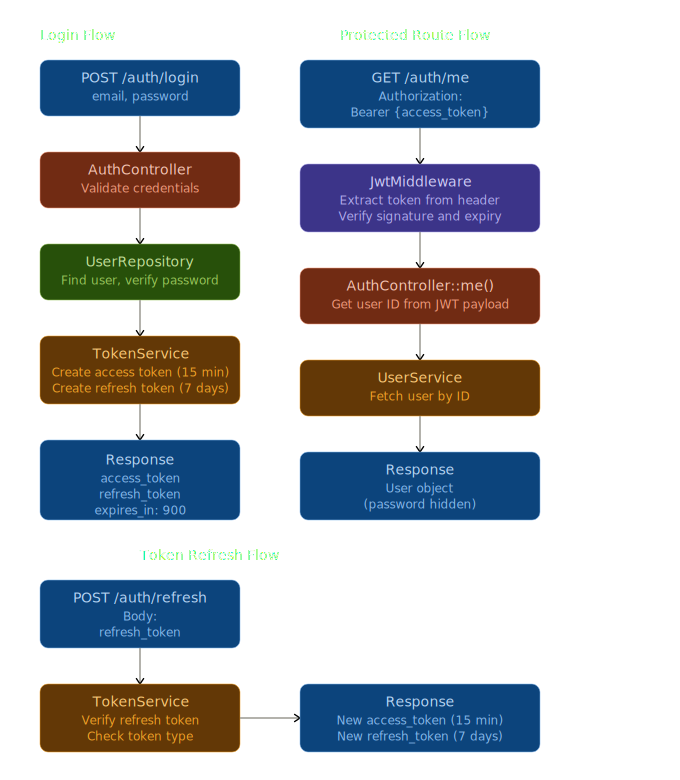
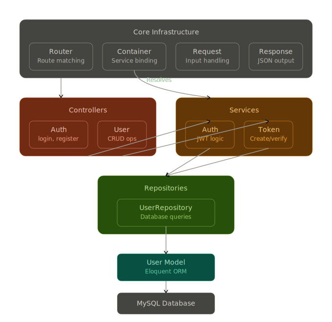
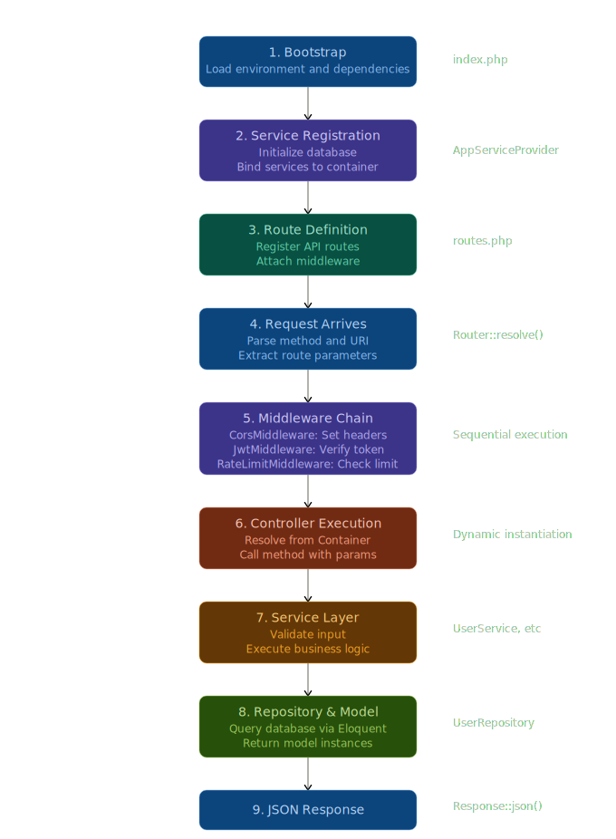
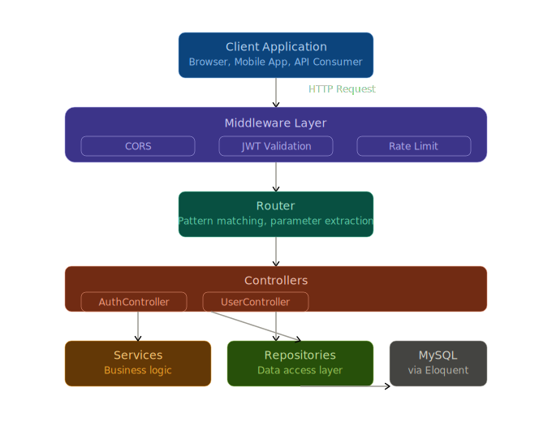

# Architecture Overview

This is a custom PHP JWT authentication system built with a modular MVC-style architecture. Let me break down the flow and structure visually.The system follows a clean layered architecture where requests flow from the client through middleware filters, get routed to controllers, which delegate to services for business logic and repositories for data access.

## JWT Authentication Flow

The authentication system uses a dual-token approach: short-lived access tokens for API calls and long-lived refresh tokens to obtain new access tokens without re-authentication.

## Component Dependencies

## Request Lifecycle

## Key Components Breakdown

Here's a summary of the major components:

**Core Layer:**

- `Router` - Pattern-based URL matching with parameter extraction
- `Container` - Dependency injection container for service resolution
- `Request/Response` - HTTP abstraction layer
- `ErrorHandler` - Global exception handling

**Authentication:**

- `AuthService` - JWT token generation and verification using Firebase JWT library
- `TokenService` - Dual-token system (access: 15min, refresh: 7 days)
- `JwtMiddleware` - Bearer token validation with payload extraction

**Controllers:**

- `AuthController` - Login, register, refresh, and /me endpoints
- `UserController` - User CRUD operations

**Services:**

- `UserService` - Email validation, user creation, and retrieval logic

**Data Layer:**

- `UserRepository` - Database query abstraction
- `User Model` - Eloquent ORM model with hidden password field
- `Database` - Eloquent Capsule setup for MySQL connection

**Configuration:**

- Environment-based DB credentials
- JWT secret and expiration settings
- OpenAPI/Swagger annotations throughout

The system uses manual routing (no framework), Eloquent for ORM, and follows a clean separation between HTTP handling, business logic, and data access.
