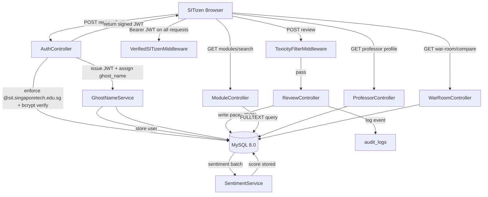

# SITizen Review — Architecture Plan

## 1. Architecture Overview

SITizen Review is a domain-specific academic intelligence platform engineered for the Singapore Institute of Technology's unique pedagogical model. Unlike generic review platforms, it encodes SIT's 13-week trimester velocity, cluster-based degree taxonomy (ICT, ENG, HSS, AS, BCD), joint-degree partner anomalies (DigiPen, Newcastle, Glasgow), and the IWSP industry bridge directly into its data model and UX. The system is built on a strict separation of concerns: a stateless PHP 8.2 / Slim 4 RESTful backend, a MySQL 8.0 persistence layer, and a Vite-bundled Vanilla JS + Tailwind CSS frontend.

The backend follows a middleware-chain architecture where every request passes through authentication (local JWT — email + bcrypt password, SIT email domain enforced at registration), rate limiting, and content safety (toxicity filter) before reaching route handlers. The "SIT Pacer" metric system is stored as a structured JSON column, enabling schema flexibility for future metrics while keeping SQL aggregation fast via generated columns. Review bombing detection is handled via an immutable `audit_logs` table that captures IP fingerprints, request deltas, and temporal clustering signals.

The frontend is a single-page application (SPA) served as static assets via Nginx, communicating with the backend exclusively through the versioned REST API. All visualizations — the PacerGauge SVG speedometer, ProfessorSkillRadar hexagonal spider chart, and WeeklyTimeline 13-node interactive timeline — are built with zero charting-library dependencies (raw Canvas/SVG), with the exception of Chart.js for the Difficulty vs. Reward scatter plot.

---

## 2. Project Directory Structure

```
inf1005-15cscc-p8/
├── docker-compose.yml
├── .env.example
├── plans/
│   └── architecture.md
├── backend/
│   ├── Dockerfile
│   ├── composer.json
│   ├── public/
│   │   └── index.php                  # Slim 4 entry point
│   ├── src/
│   │   ├── App/
│   │   │   └── AppFactory.php
│   │   ├── Middleware/
│   │   │   ├── VerifiedSITizenMiddleware.php
│   │   │   ├── AdminMiddleware.php              # requires role='admin' in JWT claim
│   │   │   ├── ToxicityFilterMiddleware.php
│   │   │   ├── RateLimitMiddleware.php
│   │   │   └── RedactionMiddleware.php
│   │   ├── Controllers/
│   │   │   ├── ModuleController.php
│   │   │   ├── ReviewController.php
│   │   │   ├── ProfessorController.php
│   │   │   ├── AuthController.php
│   │   │   ├── WarRoomController.php
│   │   │   └── AdminController.php              # moderation queue, user management, audit log viewer
│   │   ├── Models/
│   │   │   ├── User.php
│   │   │   ├── Module.php
│   │   │   ├── Professor.php
│   │   │   ├── Review.php
│   │   │   ├── TrimesterOffering.php
│   │   │   └── IWSPSkill.php
│   │   ├── Services/
│   │   │   ├── AuthService.php              # register, login, JWT issue/verify, password reset
│   │   │   ├── GhostNameService.php
│   │   │   ├── SentimentService.php
│   │   │   ├── FileUploadService.php
│   │   │   └── StudyGuideExportService.php
│   │   └── Routes/
│   │       └── api.php
│   ├── config/
│   │   ├── database.php
│   │   └── jwt.php                          # JWT secret, TTL, algorithm
│   └── storage/
│       └── uploads/                   # Sanitized syllabus/rubric uploads
├── frontend/
│   ├── index.html
│   ├── vite.config.js
│   ├── package.json
│   ├── tailwind.config.js
│   ├── postcss.config.js
│   ├── manifest.webmanifest           # PWA manifest (name, icons, display, theme_color)
│   ├── sw.js                          # Service Worker — Workbox generated via vite-plugin-pwa
│   └── src/
│       ├── main.js
│       ├── router.js
│       ├── registerSW.js              # PWA service worker registration + install prompt
│       ├── api/
│       │   ├── modules.js
│       │   ├── reviews.js
│       │   ├── professors.js
│       │   └── auth.js
│       ├── components/
│       │   ├── PacerGauge.js          # SVG speedometer
│       │   ├── ProfessorSkillRadar.js # Hexagonal spider chart (responsive viewBox)
│       │   ├── WeeklyTimeline.js      # 13-week interactive timeline (horizontal scroll on mobile)
│       │   ├── WarRoom.js             # Split-pane compare (stacked on mobile, side-by-side on md+)
│       │   ├── DarkModeToggle.js      # localStorage persistence
│       │   ├── VibeTags.js            # SIT-specific tag taxonomy
│       │   ├── DifficultyScatter.js   # Chart.js scatter plot
│       │   ├── BottomNavBar.js        # Mobile bottom navigation bar (visible ≤md)
│       │   └── MobileDrawer.js        # Slide-in filter/options drawer for mobile
│       ├── pages/
│       │   ├── HomePage.js
│       │   ├── ModuleSearchPage.js
│       │   ├── ProfessorProfilePage.js
│       │   ├── ReviewFormPage.js
│       │   ├── WarRoomPage.js
│       │   └── PathwayPlannerPage.js
│       └── styles/
│           ├── main.css               # Tailwind directives + custom vars
│           └── mobile.css             # Mobile-specific overrides (touch targets, scroll snap)
├── nginx/
│   └── default.conf
└── database/
    ├── schema.sql
    └── seeds/
        ├── modules_seed.sql
        └── professors_seed.sql
```

---

## 3. Database Schema (MySQL 8.0 DDL)

```sql
-- ============================================================
-- SITizen Review — MySQL 8.0 Schema
-- ============================================================

SET NAMES utf8mb4;
SET time_zone = '+08:00';

-- ------------------------------------------------------------
-- Joint Degree Partner Institutions
-- ------------------------------------------------------------
CREATE TABLE joint_degree_partners (
    id          TINYINT UNSIGNED AUTO_INCREMENT PRIMARY KEY,
    code        VARCHAR(20)  NOT NULL UNIQUE,       -- 'DIGIPEN', 'NEWCASTLE', 'GLASGOW'
    name        VARCHAR(100) NOT NULL,
    grading_notes TEXT,                             -- DigiPen steep curve, Glasgow project-weighted, etc.
    created_at  TIMESTAMP DEFAULT CURRENT_TIMESTAMP
) ENGINE=InnoDB DEFAULT CHARSET=utf8mb4;

-- ------------------------------------------------------------
-- Academic Clusters
-- ------------------------------------------------------------
CREATE TABLE clusters (
    id          TINYINT UNSIGNED AUTO_INCREMENT PRIMARY KEY,
    code        CHAR(5)    NOT NULL UNIQUE,         -- 'ICT', 'ENG', 'HSS', 'AS', 'BCD'
    name        VARCHAR(80) NOT NULL
) ENGINE=InnoDB DEFAULT CHARSET=utf8mb4;

-- ------------------------------------------------------------
-- Users (Verified SITizens)
-- ------------------------------------------------------------
CREATE TABLE users (
    id              INT UNSIGNED AUTO_INCREMENT PRIMARY KEY,
    sit_email       VARCHAR(120) NOT NULL UNIQUE,   -- enforced: must end @sit.singaporetech.edu.sg
    password_hash   VARCHAR(255) NOT NULL,           -- bcrypt (cost 12)
    ghost_name      VARCHAR(60)  NOT NULL UNIQUE,   -- e.g. "QuantumOtter42" — anonymity layer
    cluster_id      TINYINT UNSIGNED,
    is_verified     TINYINT(1)   DEFAULT 0,          -- email verification token flow
    is_banned       TINYINT(1)   DEFAULT 0,
    role            ENUM('user','admin') NOT NULL DEFAULT 'user',  -- 'admin' grants moderation access
    created_at      TIMESTAMP    DEFAULT CURRENT_TIMESTAMP,
    last_login_at   TIMESTAMP    NULL,
    CONSTRAINT fk_users_cluster FOREIGN KEY (cluster_id) REFERENCES clusters(id)
) ENGINE=InnoDB DEFAULT CHARSET=utf8mb4;

CREATE INDEX idx_users_role ON users (role);

-- Full-text on ghost_name for moderation lookups
CREATE INDEX idx_users_ghost ON users (ghost_name);

-- ------------------------------------------------------------
-- Password Reset Tokens
-- ------------------------------------------------------------
CREATE TABLE password_reset_tokens (
    id          INT UNSIGNED AUTO_INCREMENT PRIMARY KEY,
    user_id     INT UNSIGNED NOT NULL,
    token_hash  VARCHAR(64)  NOT NULL UNIQUE,  -- SHA-256 of random token; never store raw
    expires_at  TIMESTAMP    NOT NULL,
    used_at     TIMESTAMP    NULL,             -- set on consumption; NULL = still valid
    CONSTRAINT fk_prt_user FOREIGN KEY (user_id) REFERENCES users(id) ON DELETE CASCADE
) ENGINE=InnoDB DEFAULT CHARSET=utf8mb4;

CREATE INDEX idx_prt_expires ON password_reset_tokens (expires_at);

-- ------------------------------------------------------------
-- Email Verification Tokens
-- ------------------------------------------------------------
CREATE TABLE email_verification_tokens (
    id          INT UNSIGNED AUTO_INCREMENT PRIMARY KEY,
    user_id     INT UNSIGNED NOT NULL,
    token_hash  VARCHAR(64)  NOT NULL UNIQUE,
    expires_at  TIMESTAMP    NOT NULL,
    CONSTRAINT fk_evt_user FOREIGN KEY (user_id) REFERENCES users(id) ON DELETE CASCADE
) ENGINE=InnoDB DEFAULT CHARSET=utf8mb4;

-- ------------------------------------------------------------
-- Professors
-- ------------------------------------------------------------
CREATE TABLE professors (
    id              INT UNSIGNED AUTO_INCREMENT PRIMARY KEY,
    full_name       VARCHAR(120) NOT NULL,
    staff_code      VARCHAR(20)  UNIQUE,
    cluster_id      TINYINT UNSIGNED,
    industry_bio    TEXT,                           -- IWSP relevance blurb
    partner_id      TINYINT UNSIGNED NULL,          -- NULL = SIT staff; set for joint-degree faculty
    is_active       TINYINT(1)   DEFAULT 1,
    created_at      TIMESTAMP    DEFAULT CURRENT_TIMESTAMP,
    CONSTRAINT fk_prof_cluster FOREIGN KEY (cluster_id) REFERENCES clusters(id),
    CONSTRAINT fk_prof_partner FOREIGN KEY (partner_id) REFERENCES joint_degree_partners(id)
) ENGINE=InnoDB DEFAULT CHARSET=utf8mb4;

-- ------------------------------------------------------------
-- Modules
-- ------------------------------------------------------------
CREATE TABLE modules (
    id              INT UNSIGNED AUTO_INCREMENT PRIMARY KEY,
    code            VARCHAR(20)  NOT NULL UNIQUE,   -- e.g. 'INF1005', 'CSC3103'
    nickname        VARCHAR(60),                    -- student-facing shorthand e.g. 'OS', 'Algo'
    title           VARCHAR(200) NOT NULL,
    cluster_id      TINYINT UNSIGNED NOT NULL,
    credits         TINYINT UNSIGNED DEFAULT 4,
    partner_id      TINYINT UNSIGNED NULL,          -- joint-degree originating partner
    is_core         TINYINT(1)   DEFAULT 1,
    description     TEXT,
    created_at      TIMESTAMP    DEFAULT CURRENT_TIMESTAMP,
    CONSTRAINT fk_mod_cluster  FOREIGN KEY (cluster_id) REFERENCES clusters(id),
    CONSTRAINT fk_mod_partner  FOREIGN KEY (partner_id) REFERENCES joint_degree_partners(id),
    FULLTEXT KEY ft_module_search (code, nickname, title)
) ENGINE=InnoDB DEFAULT CHARSET=utf8mb4;

-- ------------------------------------------------------------
-- Trimester Offerings (Professor × Module × Year × Trimester)
-- ------------------------------------------------------------
CREATE TABLE trimester_offerings (
    id              INT UNSIGNED AUTO_INCREMENT PRIMARY KEY,
    module_id       INT UNSIGNED NOT NULL,
    professor_id    INT UNSIGNED NOT NULL,
    academic_year   YEAR         NOT NULL,          -- e.g. 2025
    trimester_num   TINYINT UNSIGNED NOT NULL,      -- 1, 2, or 3
    cohort_size     SMALLINT UNSIGNED,
    CONSTRAINT fk_to_module    FOREIGN KEY (module_id)    REFERENCES modules(id),
    CONSTRAINT fk_to_professor FOREIGN KEY (professor_id) REFERENCES professors(id),
    UNIQUE KEY uq_offering (module_id, professor_id, academic_year, trimester_num)
) ENGINE=InnoDB DEFAULT CHARSET=utf8mb4;

-- ------------------------------------------------------------
-- IWSP Industry Skills Taxonomy
-- ------------------------------------------------------------
CREATE TABLE iwsp_skills (
    id              SMALLINT UNSIGNED AUTO_INCREMENT PRIMARY KEY,
    skill_name      VARCHAR(100) NOT NULL UNIQUE,   -- 'Cloud Architecture', 'PLC Programming'
    sector          VARCHAR(60),                    -- 'FinTech', 'MedTech', 'Manufacturing'
    description     TEXT
) ENGINE=InnoDB DEFAULT CHARSET=utf8mb4;

-- Many-to-many: modules ↔ IWSP skills
CREATE TABLE module_iwsp_skills (
    module_id       INT UNSIGNED NOT NULL,
    skill_id        SMALLINT UNSIGNED NOT NULL,
    bridge_strength TINYINT UNSIGNED NOT NULL DEFAULT 3 CHECK (bridge_strength BETWEEN 1 AND 5),
    PRIMARY KEY (module_id, skill_id),
    CONSTRAINT fk_mis_module FOREIGN KEY (module_id) REFERENCES modules(id),
    CONSTRAINT fk_mis_skill  FOREIGN KEY (skill_id)  REFERENCES iwsp_skills(id)
) ENGINE=InnoDB DEFAULT CHARSET=utf8mb4;

-- ------------------------------------------------------------
-- Reviews (Core Content)
-- ------------------------------------------------------------
CREATE TABLE reviews (
    id                  INT UNSIGNED AUTO_INCREMENT PRIMARY KEY,
    offering_id         INT UNSIGNED NOT NULL,
    user_id             INT UNSIGNED NOT NULL,
    review_body         TEXT         NOT NULL,
    -- SIT Pacer Metrics (structured JSON)
    pacer_metrics       JSON         NOT NULL,
    /*
      Expected JSON shape:
      {
        "velocity_score":         1-5,   -- syllabus density / pace
        "applied_learning_utility": 1-5, -- lab/industry relevance
        "iwsp_bridge_strength":   1-5,   -- industry applicability
        "project_to_exam_ratio":  1-5,   -- continuous vs high-stakes
        "overall":                1-5
      }
    */
    -- Week 1-13 breakdown (optional per-week comments)
    weekly_breakdown    JSON,
    /*
      Expected JSON shape:
      {
        "1":  "Intro week, light workload.",
        "7":  "Midterm crunch — 3 deadlines colliding.",
        "13": "Final project demo, very stressful."
      }
    */
    grade_received      CHAR(2),                        -- 'A+','A','B+',... 'F'; nullable (anonymous opt-in)
    vibe_tags           JSON,                           -- ["#LabKing","#StrictButFair"]
    syllabus_upload_path VARCHAR(255),                  -- sanitized storage path
    sentiment_score     DECIMAL(4,3),                   -- -1.0 to 1.0 from SentimentService
    is_flagged          TINYINT(1)   DEFAULT 0,
    is_published        TINYINT(1)   DEFAULT 1,
    created_at          TIMESTAMP    DEFAULT CURRENT_TIMESTAMP,
    updated_at          TIMESTAMP    DEFAULT CURRENT_TIMESTAMP ON UPDATE CURRENT_TIMESTAMP,
    CONSTRAINT fk_rev_offering FOREIGN KEY (offering_id) REFERENCES trimester_offerings(id),
    CONSTRAINT fk_rev_user     FOREIGN KEY (user_id)     REFERENCES users(id),
    UNIQUE KEY uq_one_review_per_user_offering (user_id, offering_id),
    FULLTEXT KEY ft_review_body (review_body)
) ENGINE=InnoDB DEFAULT CHARSET=utf8mb4;

-- Generated columns for fast Pacer aggregation
ALTER TABLE reviews
    ADD COLUMN velocity_score TINYINT UNSIGNED
        GENERATED ALWAYS AS (JSON_UNQUOTE(JSON_EXTRACT(pacer_metrics, '$.velocity_score'))) STORED,
    ADD COLUMN overall_score TINYINT UNSIGNED
        GENERATED ALWAYS AS (JSON_UNQUOTE(JSON_EXTRACT(pacer_metrics, '$.overall'))) STORED;

CREATE INDEX idx_rev_velocity ON reviews (velocity_score);
CREATE INDEX idx_rev_overall  ON reviews (overall_score);

-- ------------------------------------------------------------
-- Audit Logs (Immutable — no UPDATE/DELETE on this table)
-- ------------------------------------------------------------
CREATE TABLE audit_logs (
    id              BIGINT UNSIGNED AUTO_INCREMENT PRIMARY KEY,
    event_type      VARCHAR(60)  NOT NULL,          -- 'REVIEW_SUBMIT','REVIEW_FLAG','LOGIN','RATE_LIMIT_HIT'
    actor_user_id   INT UNSIGNED NULL,
    target_id       INT UNSIGNED NULL,              -- review_id, professor_id, etc.
    target_type     VARCHAR(40)  NULL,              -- 'review','professor','module'
    ip_fingerprint  VARCHAR(64)  NOT NULL,          -- SHA-256 of IP+UserAgent (not raw IP)
    payload         JSON,                           -- request snapshot (redacted)
    created_at      TIMESTAMP    DEFAULT CURRENT_TIMESTAMP
) ENGINE=InnoDB DEFAULT CHARSET=utf8mb4;

-- Temporal index for review-bombing detection window queries
CREATE INDEX idx_audit_actor_time ON audit_logs (actor_user_id, created_at);
CREATE INDEX idx_audit_ip_time    ON audit_logs (ip_fingerprint, created_at);
```

---

## 4. API Specification (Slim 4 Routes)

### Middleware Stack (applied globally)

```
Request → RateLimitMiddleware → VerifiedSITizenMiddleware → [Route Handler]
                                       ↓ (POST only)
                                ToxicityFilterMiddleware
                                       ↓
                                RedactionMiddleware (file uploads)

Admin routes additionally pass through:
Request → RateLimitMiddleware → VerifiedSITizenMiddleware → AdminMiddleware → [Admin Route Handler]
```

### Route Definitions

```php
// src/Routes/api.php

// --- Auth (local database, JWT) ---
$app->post('/api/auth/register',       [AuthController::class, 'register']);   // email+password; enforces @sit domain
$app->post('/api/auth/login',          [AuthController::class, 'login']);      // returns signed JWT
$app->post('/api/auth/logout',         [AuthController::class, 'logout']);     // client-side token discard
$app->get('/api/auth/me',              [AuthController::class, 'me']);         // decode JWT → user profile
$app->post('/api/auth/verify-email',   [AuthController::class, 'verifyEmail']);// token from registration email
$app->post('/api/auth/forgot-password',[AuthController::class, 'forgotPassword']);
$app->post('/api/auth/reset-password', [AuthController::class, 'resetPassword']);

// --- Modules ---
// GET /api/modules/search?q={query}&cluster={code}&partner={code}
$app->get('/api/modules/search',       [ModuleController::class, 'search']);
$app->get('/api/modules/{id}',         [ModuleController::class, 'show']);
$app->get('/api/modules/{id}/stats',   [ModuleController::class, 'stats']);    // aggregated Pacer metrics
$app->get('/api/modules/trending',     [ModuleController::class, 'trending']); // Trending modules by review volume

// --- Reviews ---
// POST /api/reviews — multipart/form-data; requires VerifiedSITizen + Toxicity filter
$app->post('/api/reviews',             [ReviewController::class, 'store'])
    ->add(ToxicityFilterMiddleware::class)
    ->add(RedactionMiddleware::class);
$app->get('/api/reviews/{id}',         [ReviewController::class, 'show']);
$app->delete('/api/reviews/{id}',      [ReviewController::class, 'destroy']); // own review only
$app->post('/api/reviews/{id}/flag',   [ReviewController::class, 'flag']);

// --- Professors ---
$app->get('/api/professors/{id}',      [ProfessorController::class, 'show']);
$app->get('/api/professors/{id}/sentiment-trend',
                                       [ProfessorController::class, 'sentimentTrend']); // 3-yr sparkline
$app->get('/api/professors/{id}/skill-radar',
                                       [ProfessorController::class, 'skillRadar']);     // 6-axis data

// --- War Room ---
// GET /api/war-room/compare?module={code}&prof_a={id}&prof_b={id}&year={year}
$app->get('/api/war-room/compare',     [WarRoomController::class, 'compare']);

// --- Pathway Planner ---
$app->get('/api/pathway/recommend',    [PathwayController::class, 'recommend']); // electives by IWSP bridge

// --- Study Guide Export ---
$app->get('/api/professors/{id}/study-guide', [StudyGuideController::class, 'export']); // mPDF PDF

// --- Admin (all routes require AdminMiddleware) ---
$app->group('/api/admin', function (RouteCollectorProxy $group) {
    // Moderation queue
    $group->get('/reviews/flagged',          [AdminController::class, 'flaggedReviews']);   // list flagged reviews
    $group->patch('/reviews/{id}/publish',   [AdminController::class, 'publishReview']);    // approve flagged review
    $group->patch('/reviews/{id}/reject',    [AdminController::class, 'rejectReview']);     // permanently remove
    // User management
    $group->get('/users',                    [AdminController::class, 'listUsers']);
    $group->patch('/users/{id}/ban',         [AdminController::class, 'banUser']);
    $group->patch('/users/{id}/unban',       [AdminController::class, 'unbanUser']);
    $group->patch('/users/{id}/role',        [AdminController::class, 'setRole']);          // promote/demote admin
    // Content management
    $group->post('/modules',                 [AdminController::class, 'createModule']);
    $group->patch('/modules/{id}',           [AdminController::class, 'updateModule']);
    $group->post('/professors',              [AdminController::class, 'createProfessor']);
    $group->patch('/professors/{id}',        [AdminController::class, 'updateProfessor']);
    // Audit log viewer
    $group->get('/audit-logs',               [AdminController::class, 'auditLogs']);        // filterable by event_type, actor, date
})->add(AdminMiddleware::class)->add(VerifiedSITizenMiddleware::class);
```

### Key Response Shapes

#### `GET /api/modules/search`

```json
{
  "data": [
    {
      "id": 42,
      "code": "INF1005",
      "title": "Programming Fundamentals",
      "cluster": "ICT",
      "nickname": "PF",
      "avg_pacer": {
        "velocity_score": 3.2,
        "applied_learning_utility": 4.1,
        "iwsp_bridge_strength": 3.8,
        "project_to_exam_ratio": 3.5,
        "overall": 3.8
      },
      "review_count": 87
    }
  ],
  "meta": { "total": 1, "query": "inf1005" }
}
```

#### `GET /api/professors/{id}/sentiment-trend`

```json
{
  "professor_id": 7,
  "data_points": [
    { "label": "AY2023 T1", "sentiment_avg": 0.62, "review_count": 14 },
    { "label": "AY2023 T2", "sentiment_avg": 0.71, "review_count": 11 },
    { "label": "AY2024 T1", "sentiment_avg": 0.58, "review_count": 19 }
  ]
}
```

#### `GET /api/war-room/compare`

```json
{
  "module": { "code": "CSC2103", "title": "Data Structures" },
  "comparison": {
    "prof_a": {
      "id": 3,
      "name": "Dr. Chan Wei Liang",
      "ghost_metrics": { "velocity_score": 4.2, "grading_fairness": 3.9 }
    },
    "prof_b": {
      "id": 11,
      "name": "Assoc Prof Rajan Kumar",
      "ghost_metrics": { "velocity_score": 2.8, "grading_fairness": 4.5 }
    },
    "differential": {
      "velocity_score": 1.4,
      "grading_fairness": -0.6
    }
  }
}
```

---

## 5. Frontend Component Architecture

### 5.1 PacerGauge (SVG Speedometer)

- Input: `velocityScore` (1–5)
- SVG arc from 210° to -30° (240° sweep), divided into 5 zones (color-coded: green→red)
- Needle rotates via CSS `transform: rotate()` with smooth transition
- Labels: "Chill" (1) → "No Sleep" (5)
- File: [`PacerGauge.js`](frontend/src/components/PacerGauge.js)

### 5.2 ProfessorSkillRadar (Hexagonal Spider Chart)

- 6 axes: Approachability, Industry Exp, Grading Fairness, Feedback Speed, Technical Depth, Pacing
- Pure SVG — no library dependency
- Polygon vertices computed from polar coordinates
- Supports two overlapping datasets (for WarRoom comparison mode)
- File: [`ProfessorSkillRadar.js`](frontend/src/components/ProfessorSkillRadar.js)

### 5.3 WeeklyTimeline (13-Node Interactive)

- Horizontal scrollable timeline with 13 clickable nodes
- Node color encodes historical "pain intensity" (aggregated from weekly_breakdown JSON)
- Clicking a node opens a popover with historical comments for that week
- File: [`WeeklyTimeline.js`](frontend/src/components/WeeklyTimeline.js)

### 5.4 WarRoom Interface (Split-Pane)

- Two-column layout (CSS Grid) with sticky headers
- Differential highlighting: positive delta = green badge, negative delta = red badge
- Embeds two `ProfessorSkillRadar` instances with overlapping render
- File: [`WarRoom.js`](frontend/src/components/WarRoom.js)

### 5.5 DarkModeToggle

- Reads/writes `localStorage.getItem('sit-theme')` — values: `'dark'` | `'light'`
- Applies `class="dark"` to `<html>` for Tailwind dark variant activation
- "SIT Night Owl" branding with moon/sun SVG icons in SIT Red accent
- File: [`DarkModeToggle.js`](frontend/src/components/DarkModeToggle.js)

### 5.6 Tailwind Config (Dark Mode + SIT Brand)

```js
// tailwind.config.js
export default {
  darkMode: 'class',
  content: ['./index.html', './src/**/*.{js,html}'],
  theme: {
    extend: {
      colors: {
        'sit-red':    '#D62B2B',
        'sit-dark':   '#121212',
        'sit-surface':'#1E1E1E',
        'sit-border': '#2A2A2A',
        'sit-muted':  '#9CA3AF',
      },
      fontFamily: {
        sans: ['Inter', 'sans-serif'],
        mono: ['JetBrains Mono', 'monospace'],
      },
    },
  },
  plugins: [],
};
```

---

## 5.7 PWA Manifest & Mobile-Responsive Layout

### Progressive Web App (PWA)

SITizen Review ships as an installable PWA so students can access it from their phone home screen during module registration sprints without app-store friction.

**`manifest.webmanifest`**

```json
{
  "name": "SITizen Review",
  "short_name": "SITizen",
  "description": "Academic intelligence platform for SIT students",
  "start_url": "/",
  "display": "standalone",
  "orientation": "portrait-primary",
  "background_color": "#121212",
  "theme_color": "#D62B2B",
  "icons": [
    { "src": "/icons/icon-192.png", "sizes": "192x192", "type": "image/png", "purpose": "any maskable" },
    { "src": "/icons/icon-512.png", "sizes": "512x512", "type": "image/png", "purpose": "any maskable" }
  ],
  "screenshots": [
    { "src": "/screenshots/mobile-home.png", "sizes": "390x844", "type": "image/png", "form_factor": "narrow" },
    { "src": "/screenshots/desktop-warroom.png", "sizes": "1280x800", "type": "image/png", "form_factor": "wide" }
  ]
}
```

**Service Worker Strategy (`vite-plugin-pwa` + Workbox)**

| Route Pattern | Cache Strategy | TTL |
| ------------- | -------------- | --- |
| `/` and all SPA HTML | `NetworkFirst` | 24hr |
| `/assets/**` (JS/CSS bundles) | `CacheFirst` — immutable hashes | Forever |
| `/api/modules/search` | `StaleWhileRevalidate` | 1hr |
| `/api/professors/{id}` | `NetworkFirst` | 30min |
| `/api/reviews` POST | **Never cached** — always network | |

**`registerSW.js`** handles:

- `BeforeInstallPromptEvent` — deferred install prompt shown as a dismissible banner after 2nd visit
- Update notification toast: "New version available — reload to update"

---

### Mobile-Responsive Layout Constraints

**Breakpoint Contract (Tailwind defaults)**

| Breakpoint | Width | Layout Behaviour |
| ---------- | ----- | ---------------- |
| default (xs) | <640px | Single-column stack; `BottomNavBar` visible |
| `sm` | ≥640px | Single-column, wider cards |
| `md` | ≥768px | Two-column grid unlocked; `BottomNavBar` hidden |
| `lg` | ≥1024px | Full three-column layout + sticky sidebars |

**Component-specific mobile rules**

- **`PacerGauge`** — SVG `viewBox` scales fluidly; minimum render size 120×80px on xs.
- **`ProfessorSkillRadar`** — collapses to 280×280 on xs; touch-tap on axis label shows tooltip instead of hover.
- **`WeeklyTimeline`** — horizontal `overflow-x: scroll` with `scroll-snap-type: x mandatory` on xs; each week node is a 44px touch target (WCAG 2.5.5).
- **`WarRoom`** — `grid-cols-1` on xs/sm (stacked, tabbed toggle between Prof A / Prof B); `grid-cols-2` from `md` upward.
- **`BottomNavBar`** — fixed bottom bar with 4 icons: Home, Search, My Reviews, Profile. Hidden at `md+` via `md:hidden`.
- **`MobileDrawer`** — slide-in from bottom (CSS `transform: translateY`) for filter options on search/pathway pages. Triggered by a FAB button.

**Touch & Accessibility Minimums**

- All interactive elements: minimum 44×44px touch target.
- Focus rings: `ring-2 ring-sit-red` on `:focus-visible`.
- No hover-only interactions — all hover states have equivalent tap/focus behaviours.
- `prefers-reduced-motion`: disable CSS transitions on gauge needle and radar polygon morphs.

**`mobile.css` key rules**

```css
/* Horizontal scroll snap for WeeklyTimeline */
.week-timeline-track {
  display: flex;
  overflow-x: scroll;
  scroll-snap-type: x mandatory;
  -webkit-overflow-scrolling: touch;
}
.week-node {
  scroll-snap-align: center;
  min-width: 64px;
  min-height: 44px;
}

/* WarRoom stacked tab toggle on mobile */
@media (max-width: 767px) {
  .war-room-grid { grid-template-columns: 1fr; }
  .war-room-tab-bar { display: flex; }
}

/* Reduce motion */
@media (prefers-reduced-motion: reduce) {
  .pacer-needle, .radar-polygon { transition: none !important; }
}
```

**`vite.config.js` additions for PWA**

```js
import { VitePWA } from 'vite-plugin-pwa';

export default {
  plugins: [
    VitePWA({
      registerType: 'autoUpdate',
      manifest: false,          // use external manifest.webmanifest
      workbox: {
        globPatterns: ['**/*.{js,css,html,png,svg,woff2}'],
        runtimeCaching: [
          {
            urlPattern: /^\/api\/modules\/search/,
            handler: 'StaleWhileRevalidate',
            options: { cacheName: 'api-modules', expiration: { maxAgeSeconds: 3600 } }
          },
          {
            urlPattern: /^\/api\/professors\/\d+$/,
            handler: 'NetworkFirst',
            options: { cacheName: 'api-professors', expiration: { maxAgeSeconds: 1800 } }
          }
        ]
      }
    })
  ]
};
```

---

## 6. Docker Orchestration

### `docker-compose.yml`

```yaml
version: '3.9'

services:
  app:
    build:
      context: ./backend
      dockerfile: Dockerfile
    container_name: sitizen_app
    restart: unless-stopped
    volumes:
      - ./backend:/var/www/html
      - ./backend/storage/uploads:/var/www/html/storage/uploads
    environment:
      - DB_HOST=db
      - DB_PORT=3306
      - DB_DATABASE=${DB_DATABASE}
      - DB_USERNAME=${DB_USERNAME}
      - DB_PASSWORD=${DB_PASSWORD}
      - APP_ENV=${APP_ENV:-production}
      - JWT_SECRET=${JWT_SECRET}
      - OAUTH_CLIENT_ID=${OAUTH_CLIENT_ID}
      - OAUTH_CLIENT_SECRET=${OAUTH_CLIENT_SECRET}
    networks:
      - sitizen_net
    depends_on:
      db:
        condition: service_healthy

  web:
    image: nginx:1.25-alpine
    container_name: sitizen_web
    restart: unless-stopped
    ports:
      - "80:80"
      - "443:443"
    volumes:
      - ./nginx/default.conf:/etc/nginx/conf.d/default.conf:ro
      - ./frontend/dist:/var/www/static:ro       # Vite build output
      - ./backend/public:/var/www/html/public:ro
    networks:
      - sitizen_net
    depends_on:
      - app

  db:
    image: mysql:8.0
    container_name: sitizen_db
    restart: unless-stopped
    environment:
      MYSQL_DATABASE: ${DB_DATABASE}
      MYSQL_USER:     ${DB_USERNAME}
      MYSQL_PASSWORD: ${DB_PASSWORD}
      MYSQL_ROOT_PASSWORD: ${DB_ROOT_PASSWORD}
    volumes:
      - db_data:/var/lib/mysql
      - ./database/schema.sql:/docker-entrypoint-initdb.d/01-schema.sql:ro
      - ./database/seeds:/docker-entrypoint-initdb.d/seeds:ro
    ports:
      - "3306:3306"
    healthcheck:
      test: ["CMD", "mysqladmin", "ping", "-h", "localhost"]
      interval: 10s
      timeout: 5s
      retries: 5
    networks:
      - sitizen_net

networks:
  sitizen_net:
    driver: bridge

volumes:
  db_data:
```

### `backend/Dockerfile` (PHP 8.2 FPM)

```dockerfile
FROM php:8.2-fpm-alpine

RUN apk add --no-cache \
        git curl unzip libzip-dev \
        freetype-dev libjpeg-turbo-dev libpng-dev \
        oniguruma-dev icu-dev linux-headers \
    && docker-php-ext-install \
        pdo pdo_mysql mbstring zip intl opcache pcntl

COPY --from=composer:2 /usr/bin/composer /usr/bin/composer

WORKDIR /var/www/html

COPY composer.json composer.lock ./
RUN composer install --no-dev --optimize-autoloader

COPY . .

RUN chown -R www-data:www-data storage/uploads

EXPOSE 9000
CMD ["php-fpm"]
```

### `nginx/default.conf`

```nginx
server {
    listen 80;
    server_name _;

    # Static frontend assets (Vite dist)
    root /var/www/static;
    index index.html;

    # SPA fallback for frontend routes
    location / {
        try_files $uri $uri/ /index.html;
        expires 1d;
        add_header Cache-Control "public, immutable";
    }

    # API proxy → PHP-FPM
    location /api/ {
        root /var/www/html/public;
        index index.php;
        try_files $uri /index.php$is_args$args;
    }

    location ~ \.php$ {
        fastcgi_pass app:9000;
        fastcgi_index index.php;
        fastcgi_param SCRIPT_FILENAME /var/www/html/public$fastcgi_script_name;
        include fastcgi_params;
        fastcgi_read_timeout 60;
    }

    # Block direct access to uploads dir — served via signed URL only
    location /storage/uploads/ {
        deny all;
        return 404;
    }

    # Security headers
    add_header X-Frame-Options DENY;
    add_header X-Content-Type-Options nosniff;
    add_header Referrer-Policy strict-origin-when-cross-origin;
}
```

---

## 7. Implementation Roadmap

### Sprint 1 — MVP Foundation

- [ ] Docker Compose environment up (PHP-FPM, Nginx, MySQL)
- [ ] Database schema applied (`schema.sql`)
- [ ] Local auth: `POST /api/auth/register` + `POST /api/auth/login` + JWT issue (`AuthService`)
- [ ] SIT email domain enforcement at registration (`@sit.singaporetech.edu.sg` check)
- [ ] Email verification token flow + `POST /api/auth/verify-email`
- [ ] `VerifiedSITizenMiddleware` validates Bearer JWT on protected routes
- [ ] Ghost Name generation service (`GhostNameService`)
- [ ] `GET /api/modules/search` with MySQL FULLTEXT
- [ ] `POST /api/reviews` with Pacer JSON validation
- [ ] Basic review listing per module
- [ ] Frontend: DarkModeToggle, module search page, review form
- [ ] PWA: `manifest.webmanifest` + `vite-plugin-pwa` Workbox config
- [ ] Mobile: `BottomNavBar` component + responsive breakpoint audit on all pages
- [ ] Mobile: `registerSW.js` install prompt + update toast

### Sprint 2 — Core Visualizations

- [ ] PacerGauge SVG component (fluid viewBox, mobile min-size)
- [ ] ProfessorSkillRadar hexagonal chart (touch-tap tooltips on mobile)
- [ ] WeeklyTimeline 13-node component (horizontal scroll-snap on mobile)
- [ ] MobileDrawer slide-in component for search/pathway filter
- [ ] `GET /api/professors/{id}/skill-radar` endpoint
- [ ] `GET /api/professors/{id}/sentiment-trend` sparkline data
- [ ] Rate limiting middleware (database-backed token bucket via `audit_logs`)

### Sprint 3 — Advanced Features

- [ ] WarRoom split-pane interface + `GET /api/war-room/compare`
- [ ] ToxicityFilterMiddleware (profanity/attack detection)
- [ ] Vibe Tags taxonomy + UI
- [ ] Difficulty vs. Reward scatter plot (Chart.js + grade crowdsourcing)
- [ ] Syllabus/rubric upload with RedactionMiddleware (regex student ID strip)
- [ ] Audit log immutable write path + review bombing detection query

### Sprint 4 — Analytics & Export

- [ ] Sentiment analysis integration hook (AWS Comprehend placeholder)
- [ ] Degree Pathway Planner (`GET /api/pathway/recommend`)
- [ ] Study Guide PDF export (`mPDF` → "Professor Cheat Sheet")
- [ ] `AdminMiddleware` — checks `role='admin'` claim in JWT
- [ ] `AdminController` — moderation queue (flagged reviews: approve/reject)
- [ ] Admin: user management (ban/unban, role promotion)
- [ ] Admin: content management (create/update modules and professors)
- [ ] Admin: audit log viewer with filters
- [ ] Performance testing under enrollment-peak load simulation

---

## 8. Security Checklist

- All DB queries via PDO prepared statements — no raw interpolation
- XSS: all frontend output via `textContent` / `innerText`, never `innerHTML` on user data
- CSRF: `SameSite=Strict` cookies for session; CSRF token in form submissions
- Passwords: bcrypt cost 12 via `password_hash()` / `password_verify()`
- JWT: HS256 signed, 24hr TTL, `AuthService` issues + verifies; secret in `jwt.php` env-loaded
- Password reset: single-use token (SHA-256 random, 1hr TTL) stored in `password_reset_tokens` table
- Upload validation: MIME type check + virus scan middleware placeholder
- Syllabus redaction regex: `/\b[A-Z0-9]{7,10}\b/` strips student IDs from uploaded text
- Rate limit: 10 reviews per user per 24hr window — enforced via `audit_logs` count query
- `audit_logs` table: no UPDATE/DELETE privileges granted to app DB user

---

## 9. Data Flow Diagram


